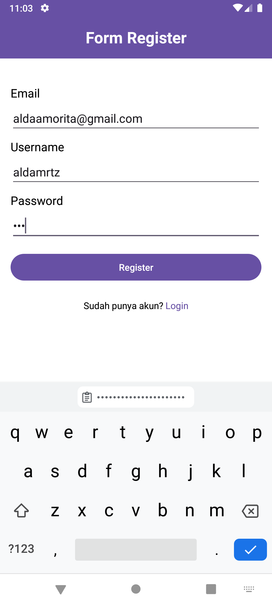
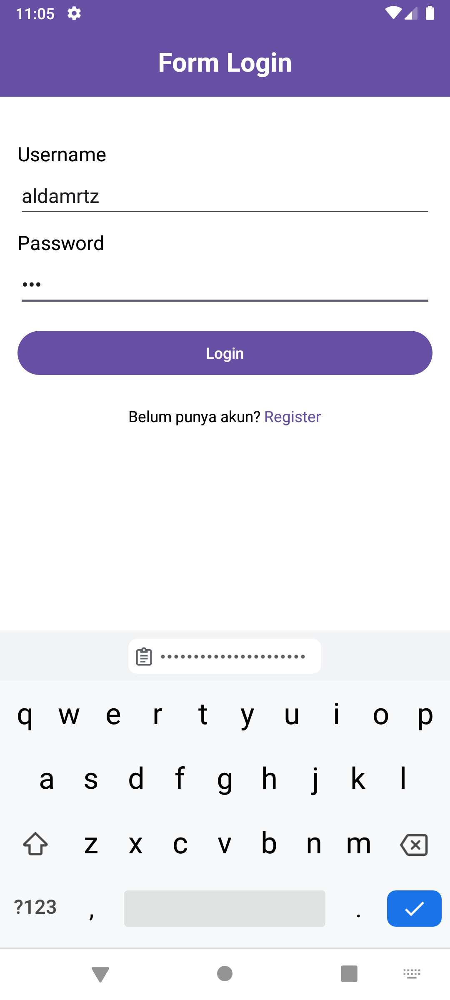
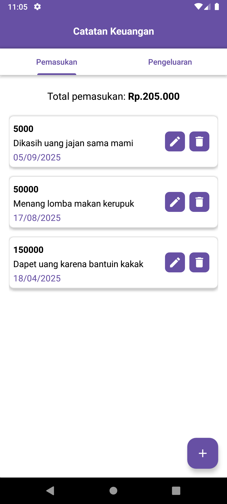
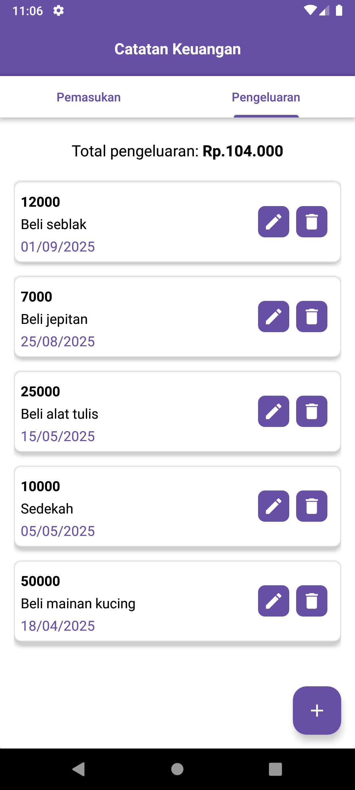
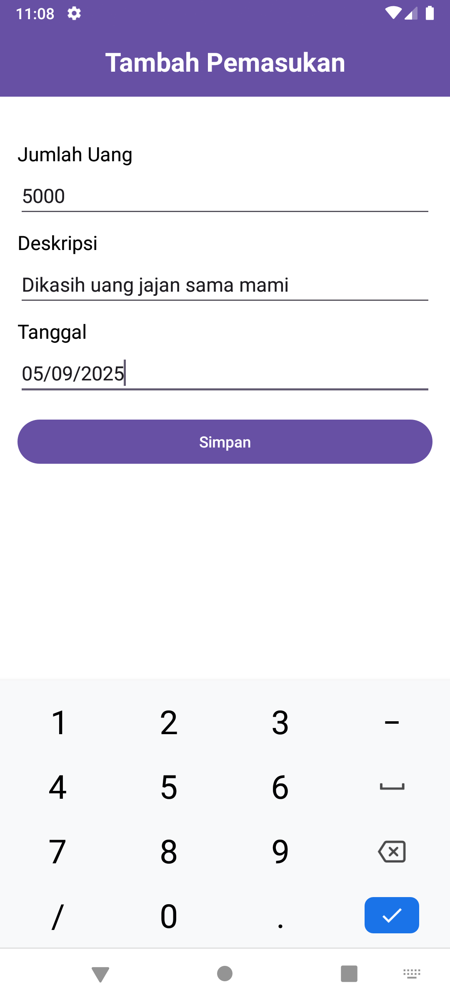
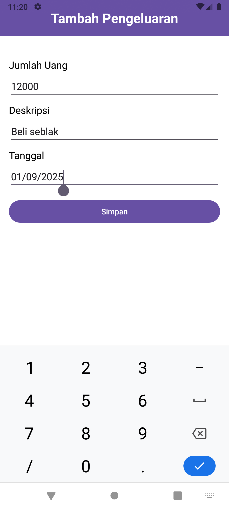
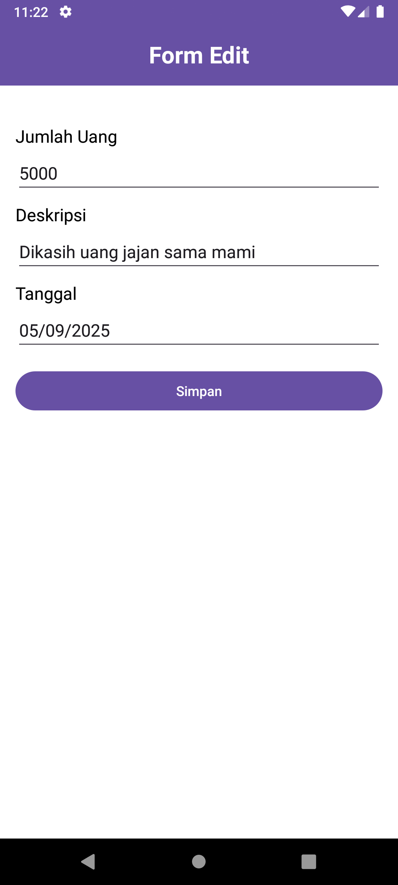
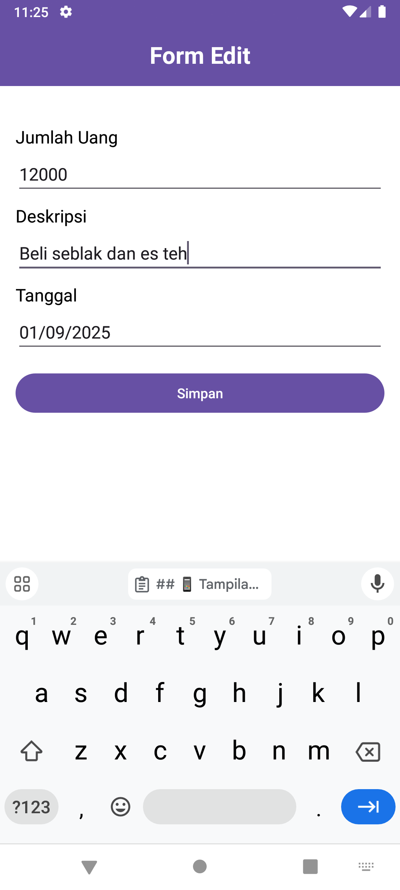

# 📒 Catatan Keuangan

Aplikasi Android untuk mencatat pemasukan dan pengeluaran harian.  
Dikembangkan menggunakan **Java**.

## 🚀 Fitur
- Menambahkan, mengubah, dan menghapus catatan keuangan
- Menampilkan ringkasan pemasukan dan pengeluaran
- Antarmuka sederhana, ringan, dan mudah digunakan

## ⚙️ Teknologi
- Java
- Android Studio

## 📦 Instalasi
1. Clone repository:
   ```bash
   git clone https://github.com/aldamrtz/CatatanKeuangan.git
2. Buka project di Android Studio
3. Jalankan aplikasi melalui emulator atau perangkat Android

## 📱 Tampilan Aplikasi

| Register | Login | Daftar Pemasukan | Daftar Pengeluaran |
|----------|-------|-----------------|------------------|
|  |  |  |  |

| Tambah Pemasukan | Tambah Pengeluaran | Edit Pemasukan | Edit Pengeluaran |
|-----------------|------------------|----------------|-----------------|
|  |  |  |  |

